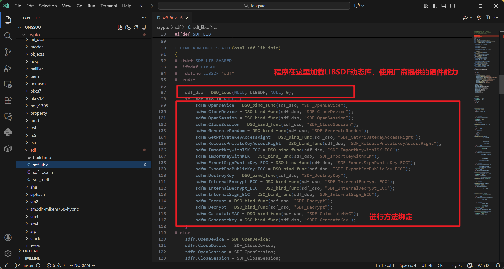

### 关于SDF与SKF模块的开发文档

| 项目描述                                                     |
| ------------------------------------------------------------ |
| 铜锁/Tongsuo是一个提供现代密码学算法和安全通信协议的开源基础密码库，为存储、网络、密钥管理、隐私计算等诸多业务场景提供底层的密码学基础能力，实现数据在传输、使用、存储等过程中的私密性、完整性和可认证性，为数据生命周期中的隐私和安全提供保护能力。 密码设备应用接口规范，对应标准为GM/T 0018-2023，定义了密码卡设备的调用接口。 智能密码钥匙接口规范，对应标准为GM/T 0016-2023定义了智能密码钥匙设备的调用接口。 **目前，Tongsuo开源项目只支持部分的SDF接口，需要参考SDF标准，支持完整的SDF接口。Tongsuo开源项目还不支持SKF接口，需要参考SKF标准，支持完整的SKF接口。** 补齐Tongsuo项目的SDF和SKF接口能力，为了帮助密码应用程序和用户更好的管理和控制密码卡和密码智能钥匙设备。 企业会帮忙协调密码硬件设备。 |

###### 现在主分支上SDF模块的情况：

之前内部适配过蚂蚁密码卡，留下一部分代码，支持SDF的19个标准接口。





###### 目前项目无法开启SDF功能，因为在tsapi.c中缺乏了sdfe_api.h，这个厂商提供的头文件。


### 之前项目中的调用方式

这里sdfe_api.h就是厂商提供的头文件，这里直接加载动态库，进行使用。


添加适配层后的SDF/SKF，用TSAPI_SDF_\*和TSAPI_SKF\_\*转发标准接口，构建了完整的适配层。

### PR中的SDF/SKF模块完成情况

完整支持SDF 2012标准的45个接口，并能够向前兼容SDF 2023的73个接口。


完整支持SKF 2023的84个接口


### 测试样例

测试方式：

将厂商提供的动态库放在Tongsuo/crypto/sdf目录下，在sdf_lib.c中修改：\#  define LIBSDF "swsds"

之后编译运行测试样例代码：

```
gcc -o test test.c -lcrypto 
```

```C
#include<openssl/sdf.h>
#include<stdio.h>

const char *SDF_GetErrorString(int x){
    return "OK";
}
int  Test_Device(){
    void *hDevice = NULL;
    int ret = TSAPI_SDF_OpenDevice(&hDevice);
     printf("ret: %x\n", ret);
     printf("%d\n",0x01000002);
    if (ret == OSSL_SDR_OK) {
        printf("OpenDevice: %x\n", ret);
        ret = TSAPI_SDF_CloseDevice(hDevice);
        if (ret == OSSL_SDR_OK){
            printf("CloseDevice: %x\n", ret);
        }else{
            printf("CloseDevice failed: %x\n", ret);
        }
    } else {
        printf("OpenDevice failed: %x\n", ret);
    }
    return ret;
}
// int  Test_Session(){
//     unsigned int  ret = 0;
//     void *hDevice = NULL;
//     void *hSession = NULL;
//     ret = OpenDevice(&hDevice);
//     if (ret != OSSL_SDR_OK) {
//         printf("OpenDevice failed: %s\n", SDF_GetErrorString(ret));
//         goto cleanup;
//     }
//     ret = OpenSession(hDevice, &hSession);
//     if (ret == OSSL_SDR_OK){
//         printf("OpenSession: %s\n", SDF_GetErrorString(ret));
//     }
//     else
//     {
//         printf("OpenSession failed: %s\n", SDF_GetErrorString(ret));
//         goto cleanup;
//     }
//     ret = CloseSession(hSession);
//     hSession = NULL;
//     if (ret != OSSL_SDR_OK){
//         printf("CloseSession failed: %s\n", SDF_GetErrorString(ret));
//         goto cleanup;
//     }
// cleanup:
//     if(hSession){
//         CloseSession(hSession);
//     }
//     if(hDevice){
//         CloseDevice(hDevice);
//     }
//     return ret;
// }
// int Test_GetDeviceInfo(){
//     int ret = -1;
//     void *hDevice = NULL;
//     void *hSession = NULL;
//     ret = OpenDevice(&hDevice);
//     if (ret != OSSL_SDR_OK){
//         printf("OpenDevice failed: %s\n", SDF_GetErrorString(ret));
//         goto cleanup;
//     }
//     ret = OpenSession(hDevice, &hSession);
//     if (ret != OSSL_SDR_OK){
//         printf("OpenSession failed: %s\n", SDF_GetErrorString(ret));
//         goto cleanup;
//     }
//     DEVICEINFO deviceInfo;
//     ret = GetDeviceInfo(hSession, &deviceInfo);
//     if (ret == 0) {
//         printf("\n========== GetDeviceInfo: %s ==========\n", SDF_GetErrorString(ret));
//         printf("IssuerName: %s\n", deviceInfo.IssuerName);
//         printf("SerialNumber: %s\n", deviceInfo.SerialNumber);
//         printf("FirmwareVersion: %s\n", deviceInfo.FirmwareVersion);
//         printf("DeviceVersion: %08x\n", deviceInfo.DeviceVersion);
//         printf("StandardVersion: %d\n", deviceInfo.StandardVersion);
//         printf("AsymAlgAbility: [%08x, %08x]\n", deviceInfo.AsymAlgAbility[0], deviceInfo.AsymAlgAbility[1]);
//         printf("SymAlgAbility: %08x\n", deviceInfo.SymAlgAbility);
//         printf("HashAlgAbility: %08x\n", deviceInfo.HashAlgAbility);
//         printf("BufferSize: %d\n", deviceInfo.BufferSize);
//         printf("===============================================\n");
//     } else {
//         printf("Failed GetDeviceInfo: %s\n", SDF_GetErrorString(ret));
//     }
// cleanup:
//     if(hSession){
//         CloseSession(hSession);
//     }
//     if(hDevice){
//         CloseDevice(hDevice);
//     }
//     return ret;
// }
int main(){
    Test_Device();


    return  0;
}
```

### 测试命令行应用

**项目中实现的命令行应用可用于测试SDF接口功能的正确实现**

在tsapi_sdf和tsapi_skf中实现了为命令行应用测试定制化的接口——为上层应用服务的接口

包装了底层的TSAPI_SDF_*


**在提交的代码中，apps下放了一个data文件夹，用于命令行应用测试的工具**


支持各种操作的命令行应用。


命令行应用功能正常。除了少数标准不支持的接口。

### 注意事项

测试代码和命令行应用默认了硬件使用令牌的方式进行鉴权，类似GetPrivateKeyAccessRight这样的接口中填入的密码当前没有使用，如果使用User Pin的方式进行验证，需要修改代码中的password。

